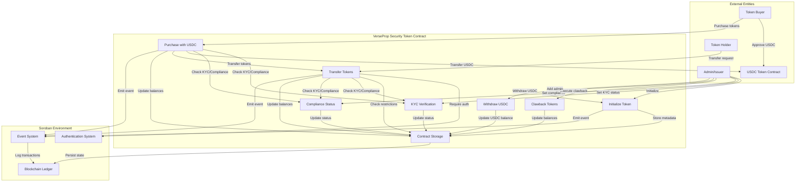

## What are we working on?

The VerseProp Security Token is a regulatory-compliant security token implemented on the Soroban platform. It provides a comprehensive tokenization solution with KYC verification, compliance status tracking, transfer controls, and direct USDC purchase functionality. The contract manages token transfers between verified users, handles regulatory compliance requirements, and enables direct token purchases using USDC as payment.

The system involves multiple entities interacting through the Soroban smart contract platform. Key flows include token initialization by admins, KYC/compliance verification for users, token transfers between verified parties, direct USDC purchases, and administrative functions like clawback and USDC withdrawal. The contract maintains state in persistent storage and emits events for all significant operations.

## What can go wrong?

### Threat table

| Threat                     | Issues                                                                                                                                                                                                            |
| -------------------------- | ----------------------------------------------------------------------------------------------------------------------------------------------------------------------------------------------------------------- |
| **S**poofing               | **Spoof.1** - Malicious actors could attempt to impersonate admin addresses to gain unauthorized access to administrative functions like KYC verification, compliance status changes, and clawback operations.    |
| **T**ampering              | **Tamper.1** - Attackers could attempt to manipulate contract storage to modify token balances, KYC status, compliance status, or USDC balances without proper authorization.                                     |
| **R**epudiation            | **Repudiate.1** - Users could deny performing token transfers, purchases, or other operations, and there may be insufficient audit trails to prove their actions.                                                 |
| **I**nformation Disclosure | **Info.1** - Sensitive information such as user balances, KYC status, compliance status, and admin addresses could be exposed through public view functions or event logs.                                        |
| **D**enial of Service      | **DoS.1** - Attackers could potentially cause the contract to become unavailable or unresponsive through gas limit attacks, storage exhaustion, or by exploiting contract logic to prevent legitimate operations. |
| **E**levation of Privilege | **Elevation.1** - Non-admin users could attempt to gain admin privileges through vulnerabilities in the admin management system or by exploiting authorization bypasses.                                          |

## What are we going to do about it?

| Threat                     | Issues                                                                                                                                                                                                                                                                                                                                                                                                                                                                               |
| -------------------------- | ------------------------------------------------------------------------------------------------------------------------------------------------------------------------------------------------------------------------------------------------------------------------------------------------------------------------------------------------------------------------------------------------------------------------------------------------------------------------------------ |
| **S**poofing               | **Spoof.1.R.1** - Implement strong authentication mechanisms using Soroban's built-in `require_auth()` function for all administrative operations.   **Spoof.1.R.2** - Use multi-signature requirements for critical administrative functions to prevent single-point-of-failure attacks.   **Spoof.1.R.3** - Implement address whitelisting and validation for admin operations to ensure only authorized addresses can perform administrative functions.                 |
| **T**ampering              | **Tamper.1.R.1** - Implement comprehensive input validation and bounds checking for all contract functions to prevent unauthorized data manipulation.   **Tamper.1.R.2** - Use Soroban's secure storage mechanisms and implement access controls to protect contract state from unauthorized modifications.   **Tamper.1.R.3** - Implement checksum validation and state verification mechanisms to detect any unauthorized changes to contract data.                      |
| **R**epudiation            | **Repudiate.1.R.1** - Implement comprehensive event logging for all contract operations using Soroban's event system to create immutable audit trails.   **Repudiate.1.R.2** - Include transaction hashes, timestamps, and user addresses in all event logs to provide complete transaction provenance.   **Repudiate.1.R.3** - Implement external monitoring and alerting systems to track and log all contract interactions for compliance and audit purposes.           |
| **I**nformation Disclosure | **Info.1.R.1** - Implement access controls on view functions to restrict sensitive information access to authorized parties only.   **Info.1.R.2** - Use encryption or hashing for sensitive data storage where appropriate, and implement data minimization principles.   **Info.1.R.3** - Implement privacy-preserving techniques such as zero-knowledge proofs for KYC and compliance verification without exposing sensitive user data.                                |
| **D**enial of Service      | **DoS.1.R.1** - Implement gas limit controls and circuit breakers to prevent resource exhaustion attacks.   **DoS.1.R.2** - Use efficient data structures and algorithms to minimize computational complexity and prevent DoS through expensive operations.   **DoS.1.R.3** - Implement rate limiting and transaction throttling mechanisms to prevent spam attacks and ensure fair resource usage.                                                                        |
| **E**levation of Privilege | **Elevation.1.R.1** - Implement strict role-based access control (RBAC) with clear separation of privileges between admin and user functions.   **Elevation.1.R.2** - Use multi-signature requirements for admin privilege changes and implement time-delayed admin modifications for critical operations.   **Elevation.1.R.3** - Implement comprehensive authorization checks at every function entry point and use the principle of least privilege for all operations. |

## Did we do a good job?

The data flow diagram was used to systematically identify threats across all interaction points between entities in the system, including external users, the contract, and the Soroban environment.

The STRIDE analysis revealed several important security considerations:

- The need for multi-signature requirements for critical admin operations
- Privacy concerns around sensitive data exposure through view functions
- Potential DoS vulnerabilities through gas limit attacks
- The importance of comprehensive audit trails for regulatory compliance
- The need for rate limiting and transaction throttling mechanisms

The treatments provide a comprehensive security framework addressing each threat category:

- Authentication and authorization controls for spoofing prevention
- Input validation and secure storage for tampering prevention
- Comprehensive logging and monitoring for repudiation prevention
- Access controls and privacy-preserving techniques for information disclosure prevention
- Resource management and rate limiting for DoS prevention
- Role-based access control and privilege separation for elevation of privilege prevention

The threat model identified several areas that may need additional consideration:

- The self-transfer bug identified in tests (line 840 in test.rs) where transferring to oneself increases balance
- Potential integer overflow vulnerabilities in arithmetic operations
- The need for emergency pause mechanisms for critical security incidents
- Consideration of upgrade mechanisms for contract improvements

For future iterations, consider:

- Including threat modeling for integration points with external systems (USDC contract, off-chain KYC providers)
- Analysis of economic attack vectors specific to security tokens
- Regulatory compliance requirements as a separate threat category
- Analysis of front-running and MEV (Maximal Extractable Value) attacks
- The impact of network congestion and transaction ordering on security
